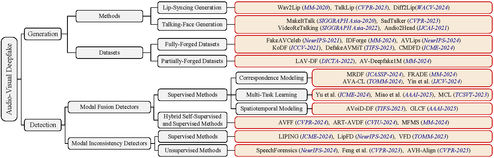

# AUDIO-VISUAL DEEPFAKE GENERATION AND DETECTION:AN EXPLORATORY SURVEY

## Appendix
- [A.Audio Visual Deepfake Detection](#A.Audio-Visual-Deepfake-Detection)
  - [Modal Fusion Detectors](#Modal-Fusion-Detectors)
  - [Modal Inconsistency Detectors](#Modal-Inconsistency-Detectors)
- [B.Generalization Experiments](#B.Generalization-Experiments)

## A.Audio Visual Deepfake Detection

We review existing work on audio-visual deepfake detection.Due to space limitations, we did not discuss all the papers in the our paper.Here we provide a comprehensive summary of audio-visual deepfake detection.

### Modal Fusion Detectors

|Paper Title|Category|Strategy|Venue|CCF Rank|Year|
|-|:-:|:-:|:-:|:-:|:-:|
|[GLCF: A Global-Local Multimodal Coherence Analysis Framework for Talking Face Generation Detection](https://arxiv.org/abs/2412.13656)|Supervised Methods|Spatiotemporal Modeling|AAAI|CCF-A|2025|
|[Multi-modal Deepfake Detection via Multi-task Audio-Visual Prompt Learning](https://ojs.aaai.org/index.php/AAAI/article/view/32042)|Supervised Methods|Multi-Task Learning|AAAI|CCF-A|2025|
|[Cross-Modality and Within-Modality Regularization for Audio-Visual DeepFake Detection](https://arxiv.org/abs/2401.05746)|Supervised Methods|Correspondence Modeling|ICASSP|CCF-B|2024|
|[FRADE: Forgery-aware Audio-distilled Multimodal Learning for Deepfake Detection](https://dl.acm.org/doi/10.1145/3664647.3681672)|Supervised Methods|Correspondence Modeling|ACM MM|CCF-A|2024|
|[Joint Audio-Visual Attention with Contrastive Learning for More General Deepfake Detection](https://dl.acm.org/doi/10.1145/3625100)|Supervised Methods|Correspondence Modeling|ACM TOMM|CCF-A|2024|
|[Fine-grained Multimodal DeepFake Classification via Heterogeneous Graphs](https://link.springer.com/article/10.1007/s11263-024-02128-1)|Supervised Methods|Correspondence Modeling|IJCV|CCF-A|2024|
|[Explicit Correlation Learning for Generalizable Cross-Modal Deepfake Detection](https://ieeexplore.ieee.org/document/10687814)|Supervised Methods|Multi-Task Learning|ICME|CCF-B|2024|
|[MCL: Multimodal Contrastive Learning for Deepfake Detection](https://ieeexplore.ieee.org/document/10243082)|Supervised Methods|Multi-Task Learning|IEEE TCSVT|CCF-A|2023|
|[AVoiD-DF: Audio-Visual Joint Learning for Detecting Deepfake](https://ieeexplore.ieee.org/document/10081373)|Supervised Methods|Spatiotemporal Modeling|IEEE TIFS|CCF-A|2023|
|[Multimodaltrace: Deepfake Detection using Audiovisual Representation Learning](https://ieeexplore.ieee.org/document/10208948)|Supervised Methods|Multi-Task Learning|CVPR Workshop|CCF-A|2023|
|[AVFF: Audio-Visual Feature Fusion for Video Deepfake Detection](https://arxiv.org/abs/2406.02951)|Hybrid Self-Supervised and Supervised Methods|Correspondence Modeling|CVPR|CCF-A|2024|
|[Audio–visual deepfake detection using articulatory representation learning](https://www.sciencedirect.com/science/article/pii/S1077314224002145)|Hybrid Self-Supervised and Supervised Methods|Correspondence Modeling|CVIU|CCF-B|2024|
|[MFMS: Learning Modality-Fused and Modality-Specific Features for Deepfake Detection and Localization Tasks](https://dl.acm.org/doi/abs/10.1145/3664647.3688984)|Hybrid Self-Supervised and Supervised Methods|Modality-Fused and Modality-Specific Features|ACM MM|CCF-A|2024|

### Modal Inconsistency Detectors

|Paper Title|Category|Venue|CCF Rank|Year|
|:-|:-:|:-:|:-:|:-:|
|[Exposing Lip-syncing Deepfakes from Mouth Inconsistencies](https://ieeexplore.ieee.org/document/10687902)|Supervised Methods|ICME|CCF-B|2024|
|[Lips Are Lying: Spotting the Temporal Inconsistency between Audio and Visual in Lip-Syncing DeepFakes](https://proceedings.neurips.cc/paper_files/paper/2024/hash/a5a5b0ff87c59172a13342d428b1e033-Abstract-Conference.html)|Supervised Methods|NeurIPS|CCF-A|2024|
|[Voice-Face Homogeneity Tells Deepfake](https://arxiv.org/abs/2203.02195)|Supervised Methods|TOMM|CCF-B|2023|
|[Audio-Visual Person-of-Interest DeepFake Detection](https://arxiv.org/abs/2204.03083)|Supervised Methods|CVPR Workshop|CCF-A|2023|
|[SpeechForensics: Audio-Visual Speech Representation Learning for Face Forgery Detection](https://arxiv.org/abs/2508.09913)|Unsupervised Methods|NeurIPS|CCF-A|2024|
|[Self-Supervised Video Forensics by Audio-Visual Anomaly Detection](https://arxiv.org/abs/2301.01767)|Unsupervised Methods|CVPR|CCF-A|2023|
|[Circumventing shortcuts in audio-visual deepfake detection datasets with unsupervised learning](https://arxiv.org/abs/2412.00175)|Unsupervised Methods|CVPR|CCF-A|2025|
|[Zero-Shot Fake Video Detection by Audio-Visual Consistency](https://arxiv.org/pdf/2406.07854)|Supervised Methods|Interspeech|CCF-C|2024|

## B.Generalization Experiments

### Benchmark Results

|&nbsp;&nbsp;&nbsp;&nbsp;&nbsp;&nbsp;Detector&nbsp;&nbsp;&nbsp;&nbsp;&nbsp;&nbsp;|&nbsp;&nbsp;&nbsp;&nbsp;&nbsp;&nbsp;Testing Set&nbsp;&nbsp;&nbsp;&nbsp;&nbsp;&nbsp;|&nbsp;&nbsp;&nbsp;&nbsp;&nbsp;&nbsp;AUC&nbsp;&nbsp;&nbsp;&nbsp;&nbsp;&nbsp;|&nbsp;&nbsp;&nbsp;&nbsp;&nbsp;&nbsp;ACC&nbsp;&nbsp;&nbsp;&nbsp;&nbsp;&nbsp;|&nbsp;&nbsp;&nbsp;&nbsp;&nbsp;&nbsp;Precision&nbsp;&nbsp;&nbsp;&nbsp;&nbsp;&nbsp;|&nbsp;&nbsp;&nbsp;&nbsp;&nbsp;&nbsp;Recall&nbsp;&nbsp;&nbsp;&nbsp;&nbsp;&nbsp;|
|:-:|:-:|:-:|:-:|:-:|:-:|
|                     | FakeAVCeleb | 0.9912 | 0.939 | 0.8998 | 0.988 |
|                     | LAV-DF      | 0.6513 | 0.561 | 0.5340 | 0.958 |
| **Yu et al.**       | IDForge     | 0.8346 | 0.617 | 0.5711 | 0.940 |
|                     | AVLips      | 0.8807 | 0.746 | 0.6864 | 0.906 |
|                     | CMDFD       | 0.7955 | 0.711 | 0.6924 | 0.757 |
|                     | FakeAVCeleb | 0.7127 | 0.625 | 0.6371 | 0.492 |
|                     | LAV-DF      | 0.5055 | 0.548 | 0.4494 | 0.211 |
| **LIPINC**          | IDForge     | 0.7882 | 0.654 | 0.8791 | 0.216 |
|                     | AVLips      | 0.7054 | 0.669 | 0.6045 | 0.353 |
|                     | CMDFD       | 0.6677 | 0.619 | 0.6503 | 0.416 |
|                     | FakeAVCeleb | 0.7242 | 0.675 | 0.8159 | 0.415 |
|                     | LAV-DF      | 0.4195 | 0.450 | 0.5112 | 0.500 |
| **LipFD**           | IDForge     | 0.6997 | 0.706 | 0.6129 | 0.055 |
|                     | AVLips      | 0.8498 | 0.802 | 0.9620 | 0.631 |
|                     | CMDFD       | 0.7472 | 0.626 | 0.6949 | 0.323 |
|                     | FakeAVCeleb | 0.7643 | 0.649 | 0.8266 | 0.454 |
|                     | LAV-DF      | 0.5594 | 0.565 | 0.5144 | 0.135 |
| **VFD**             | IDForge     | 0.4334 | 0.480 | 0.6895 | 0.504 |
|                     | AVLips      | 0.6510 | 0.567 | 0.6433 | 0.287 |
|                     | CMDFD       | 0.6892 | 0.606 | 0.7947 | 0.370 |
|                     | FakeAVCeleb | 0.9929 | 0.962 | 0.9408 | 0.986 |
|                     | LAV-DF      | 0.8537 | 0.780 | 0.7778 | 0.784 |
| **SpeechForensics** | IDForge     | 0.9567 | 0.927 | 0.9514 | 0.900 |
|                     | AVLips      | 0.9946 | 0.984 | 0.9899 | 0.978 |
|                     | CMDFD       | 0.9958 | 0.979 | 0.9878 | 0.970 |
|                     | FakeAVCeleb | 0.8086 | 0.729 | 0.6803 | 0.864 |
|                     | LAV-DF      | 0.5753 | 0.575 | 0.5632 | 0.668 |
| **Feng et al.**     | IDForge     | 0.7549 | 0.708 | 0.7023 | 0.722 |
|                     | AVLips      | 0.7439 | 0.713 | 0.7530 | 0.634 |
|                     | CMDFD       | 0.4627 | 0.500 | 0.5000 | 1.000 |
|                     | FakeAVCeleb | 0.9529 | 0.900 | 0.8556 | 0.962 |
|                     | LAV-DF      | 0.8870 | 0.814 | 0.7549 | 0.930 |
| **AVH-Align**       | IDForge     | 0.1472 | 0.501 | 0.5005 | 1.000 |
|                     | AVLips      | 0.8661 | 0.864 | 0.8085 | 0.954 |
|                     | CMDFD       | 0.8286 | 0.758 | 0.7287 | 0.822 |
