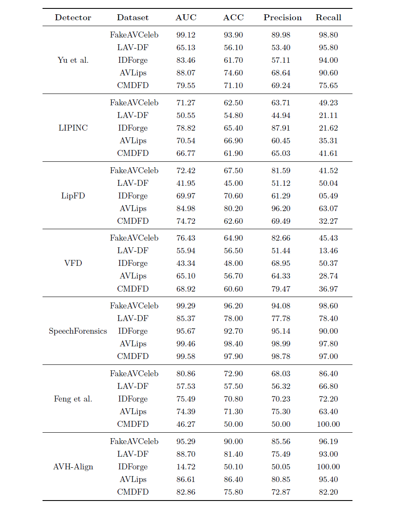

# Audio-visual Deepfake Generation And Detection:  An Exploratory Survey

## Appendix
- [A. Audio Visual Deepfake Detection](#A.Audio-Visual-Deepfake-Detection)
  - [Modal Fusion Detectors](#Modal-Fusion-Detectors)
  - [Modal Inconsistency Detectors](#Modal-Inconsistency-Detectors)
- [B. Generalization Experiments](#B.Generalization-Experiments)

## A. Audio Visual Deepfake Detection

We present a complete summary of existing work on audio-visual deepfake detection, involving publication ranks on CCF-A, CCF-B and CCF-C.

### Modal Fusion Detectors

|Paper Title|Category|Strategy|Venue|CCF Rank&nbsp;|Year|
|-|:-:|:-:|:-:|:-:|:-:|
|[GLCF: A Global-Local Multimodal Coherence Analysis Framework for Talking Face Generation Detection](https://arxiv.org/abs/2412.13656)|Supervised Methods|Spatiotemporal Modeling|AAAI|CCF-A|2025|
|[Multi-modal Deepfake Detection via Multi-task Audio-Visual Prompt Learning](https://ojs.aaai.org/index.php/AAAI/article/view/32042)|Supervised Methods|Multi-Task Learning|AAAI|CCF-A|2025|
|[FRADE: Forgery-aware Audio-distilled Multimodal Learning for Deepfake Detection](https://dl.acm.org/doi/10.1145/3664647.3681672)|Supervised Methods|Correspondence Modeling|MM|CCF-A|2024|
|[Joint Audio-Visual Attention with Contrastive Learning for More General Deepfake Detection](https://dl.acm.org/doi/10.1145/3625100)|Supervised Methods|Correspondence Modeling|TOMM|CCF-A|2024|
|[Fine-grained Multimodal DeepFake Classification via Heterogeneous Graphs](https://link.springer.com/article/10.1007/s11263-024-02128-1)|Supervised Methods|Correspondence Modeling|IJCV|CCF-A|2024|
|[MCL: Multimodal Contrastive Learning for Deepfake Detection](https://ieeexplore.ieee.org/document/10243082)|Supervised Methods|Multi-Task Learning|TCSVT|CCF-A|2023|
|[AVoiD-DF: Audio-Visual Joint Learning for Detecting Deepfake](https://ieeexplore.ieee.org/document/10081373)|Supervised Methods|Spatiotemporal Modeling|TIFS|CCF-A|2023|
|[Multiscale Adaptive Conflict-Balancing Model For Multimedia Deepfake Detection](https://arxiv.org/pdf/2505.12966)|Supervised Methods|Correspondence Modeling|ICMR|CCF-B|2025|
|[Cross-Modality and Within-Modality Regularization for Audio-Visual DeepFake Detection](https://arxiv.org/abs/2401.05746)|Supervised Methods|Correspondence Modeling|ICASSP|CCF-B|2024|
|[Explicit Correlation Learning for Generalizable Cross-Modal Deepfake Detection](https://ieeexplore.ieee.org/document/10687814)|Supervised Methods|Multi-Task Learning|ICME|CCF-B|2024|
|[Multimodaltrace: Deepfake Detection using Audiovisual Representation Learning](https://ieeexplore.ieee.org/document/10208948)|Supervised Methods|Multi-Task Learning|CVPR Workshop|CCF-A Workshop|2023|
|[AVFF: Audio-Visual Feature Fusion for Video Deepfake Detection](https://arxiv.org/abs/2406.02951)|Hybrid Self-Supervised and Supervised Methods|Correspondence Modeling|CVPR|CCF-A|2024|
|[MFMS: Learning Modality-Fused and Modality-Specific Features for Deepfake Detection and Localization Tasks](https://dl.acm.org/doi/abs/10.1145/3664647.3688984)|Hybrid Self-Supervised and Supervised Methods|Modality-Fused and Modality-Specific Features|MM|CCF-A|2024|
|[Audio–visual deepfake detection using articulatory representation learning](https://www.sciencedirect.com/science/article/pii/S1077314224002145)|Hybrid Self-Supervised and Supervised Methods|Correspondence Modeling|CVIU|CCF-B|2024|

### Modal Inconsistency Detectors

|Paper Title|Category|Venue|CCF Rank|Year|
|:-|:-:|:-:|:-:|:-:|
|[Lips Are Lying: Spotting the Temporal Inconsistency between Audio and Visual in Lip-Syncing DeepFakes](https://proceedings.neurips.cc/paper_files/paper/2024/hash/a5a5b0ff87c59172a13342d428b1e033-Abstract-Conference.html)|Supervised Methods|NeurIPS|CCF-A|2024|
|[Multimodal Neurosymbolic Approach for Explainable Deepfake Detection](https://dl.acm.org/doi/full/10.1145/3624748)|Supervised Methods|TOMM|CCF-B|2024|
|[Exposing Lip-syncing Deepfakes from Mouth Inconsistencies](https://ieeexplore.ieee.org/document/10687902)|Supervised Methods|ICME|CCF-B|2024|
|[Voice-Face Homogeneity Tells Deepfake](https://arxiv.org/abs/2203.02195)|Supervised Methods|TOMM|CCF-B|2023|
|[PVASS-MDD: Predictive Visual-Audio Alignment Self-Supervision for Multimodal Deepfake Detection](https://ieeexplore.ieee.org/abstract/document/10233898)|Supervised Methods|TCSVT|CCF-B|2023|
|[NPVForensics: Learning VA correlations in non-critical phoneme–viseme regions for deepfake detection](https://www.sciencedirect.com/science/article/pii/S0262885625000496)|Supervised Methods|Image and Vision Computing|CCF-C|2025|
|[Zero-Shot Fake Video Detection by Audio-Visual Consistency](https://arxiv.org/pdf/2406.07854)|Supervised Methods|Interspeech|CCF-C|2024|
|[Detecting Audio-Visual Deepfakes with Fine-Grained Inconsistencies](https://arxiv.org/pdf/2408.06753)|Supervised Methods|BMVC|CCF-C|2024|
|[STATISTICS-AWARE AUDIO-VISUAL DEEPFAKE DETECTOR](https://arxiv.org/pdf/2407.11650?)|Supervised Methods|ICIP|CCF-C|2024|
|[Audio-Visual Person-of-Interest DeepFake Detection](https://arxiv.org/abs/2204.03083)|Supervised Methods|CVPR Workshop|CCF-A Workshop|2023|
|[Circumventing shortcuts in audio-visual deepfake detection datasets with unsupervised learning](https://arxiv.org/abs/2412.00175)|Unsupervised Methods|CVPR|CCF-A|2025|
|[SpeechForensics: Audio-Visual Speech Representation Learning for Face Forgery Detection](https://arxiv.org/abs/2508.09913)|Unsupervised Methods|NeurIPS|CCF-A|2024|
|[Self-Supervised Video Forensics by Audio-Visual Anomaly Detection](https://arxiv.org/abs/2301.01767)|Unsupervised Methods|CVPR|CCF-A|2023|

## B. Generalization Experiments

We present our complete evaluation results on the generalization of deepfake detectors, in terms of Area Under the Curve (AUC), Accuracy (ACC), Precision, and Recall.

  

## Contact

We are looking forward to any valuable questions or suggestions, please feel free to contact us at xuhang@hrbeu.edu.cn
